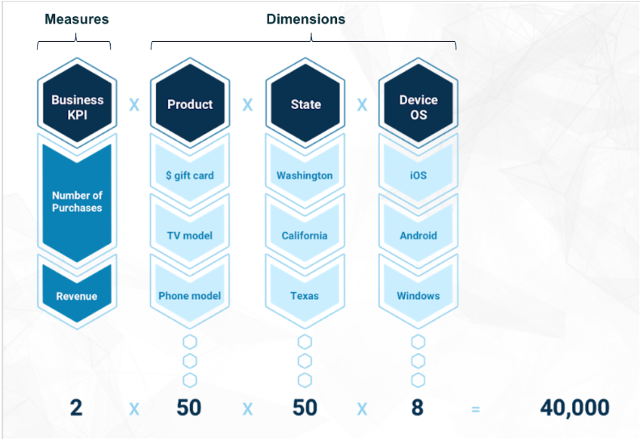

<html>
    <a href="https://www.anodot.com/" class="homepage-corner" aria-label="View source on Github">
        <svg width="100" height="100" viewBox="0 0 250 250" style="fill:#40c9c6; color:#fff; position: fixed; top: 0; border: 0; right: 0;" aria-hidden="true">
            <path d="M0,0 L250,250 L250,0 Z"></path>
            <text x="40" y="40" fill="white" style="font-size: 36px;" size="20" transform="rotate(45 70,70)">Anodot Project</text>
        </svg>
    </a>
    </style>
</html>

# 1.1 Metrics

一个metric是维度和测量值的唯一组合，Metrics是我们根据需求定义的数据，对anodot来说具有上限，一般不能多于200k.如下图所示：
测量值指标有：Number of Purchases, Revenue
维度指标：Product, State, Device OS
Metrics = 测量值指标数*Product(取值范围)* State (取值范围)* Device OS(取值范围)

