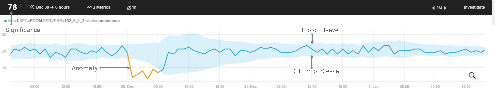
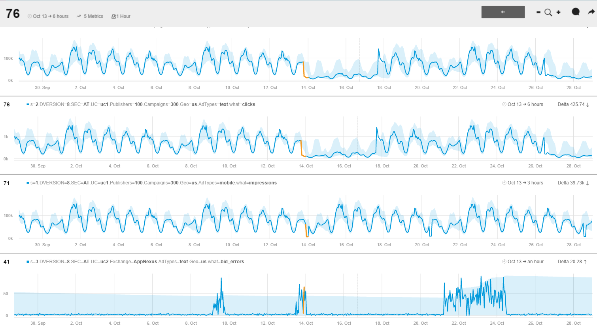

<html>
    <a href="https://www.anodot.com/" class="homepage-corner" aria-label="View source on Github">
        <svg width="100" height="100" viewBox="0 0 250 250" style="fill:#40c9c6; color:#fff; position: fixed; top: 0; border: 0; right: 0;" aria-hidden="true">
            <path d="M0,0 L250,250 L250,0 Z"></path>
            <text x="40" y="40" fill="white" style="font-size: 36px;" size="20" transform="rotate(45 70,70)">Anodot Project</text>
        </svg>
    </a>
    </style>
</html>

# 1.2 Anomiles

异常是指在一个或多个metrics指标中偏离正常模式的行为，这些指标表示意外行为。从定义上看，异常现象不是好是坏。它们只是意想不到的结果。异常可能是异常高的用户登录数量，也可能是异常低的用户登录数量。例如，如果带宽使用峰值突然超出了预期的时间，那么，Anodot将会产生一个异常，管理员可能会尝试调查为什么会发生这种情况，可能是因为DDOS攻击。

一旦你开始向Anodot发送你的metrics，Anodot的机器学习算法会自动跟踪它们，以确定一个预期的模式。一个正常结果的有限范围，称为每个度量的基线。只要度量值在已知的正常范围内，就不会检测到异常。

每个度量的正常范围是使用Anodot的申请专利的算法确定的，并且基于许多自动检测的因素，如度量类别(平稳/非平稳、离散、稀疏等)、检测到的季节模式和趋势。

Anodot Significance Score是异常检测的一个重要因素。虽然每次偏离正常范围都是异常的，但并非所有的异常都是相同的。通常点击广告的用户数量减少了50% 比减少20%更有关注意义。但如果20%的下降持续了3个小时，而50%的下降只持续5分钟，则前者更有关注意义。Anodot的算法为每个异常分配一个Significance Score (0到100之间的数字)。这个分数代表了异常是异常的，与过去的度量(或度量的一组)的异常相比。使用Significance Score，可以很容易的去过滤一些不重要的异常，从而简化了警报的创建和异常的调查。

Anodot还通过它的行为拓扑学习算法来学习度量之间的关系，所以当许多相关的度量变得异常时，Anodot将它们分组以识别一个“事件风暴”，这个“事件风暴”的特征是一个或多个度量高于或低于正常范围。这些事件风暴被归类为异常。它们有助于调查和隔离异常行为的可能原因。

