<html>
    <a href="http://anodot.nie.netease.com/" class="homepage-corner" aria-label="View source on Github">
        <svg width="100" height="100" viewBox="0 0 250 250" style="fill:#40c9c6; color:#fff; position: fixed; top: 0; border: 0; right: 0;" aria-hidden="true">
            <path d="M0,0 L250,250 L250,0 Z"></path>
            <text x="40" y="40" fill="white" style="font-size: 36px;" size="20" transform="rotate(45 70,70)">Anodot Project</text>
        </svg>
    </a>
    </style>
</html>

# 2.1 集成MySQL数据

## 为各指标创建数据库表

以G89为例，我们有数据表如下

**cpu**

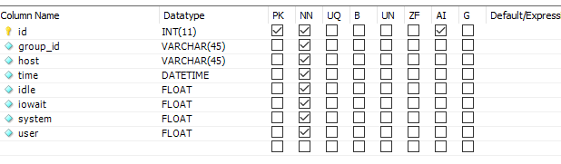

**Memory**
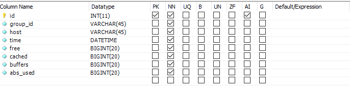

**Network**
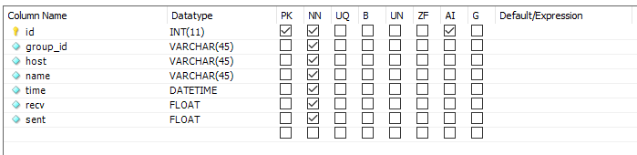

**crash_detail**
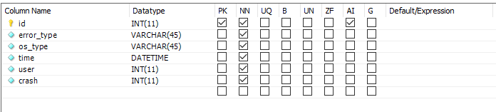

**crash_summary**
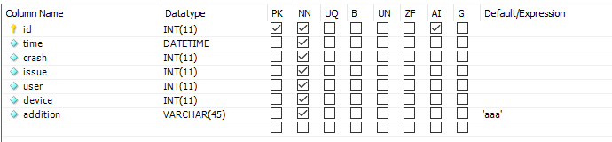

## 创建数据源

选中Anodot 的Data Collectors,

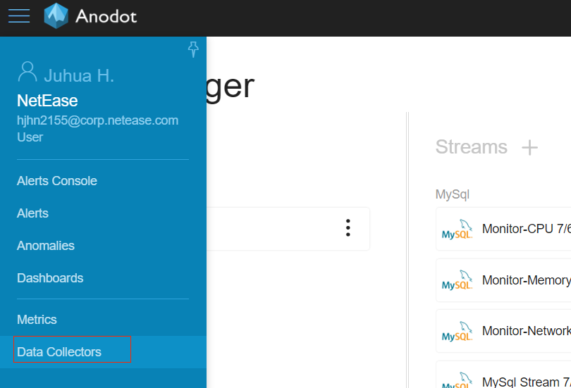

进入数据源创建界面

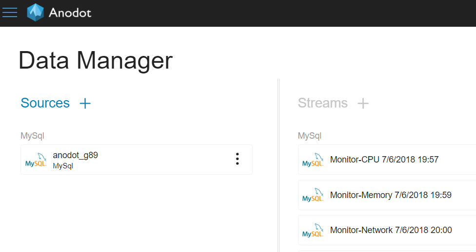

点击sources旁边的+号，进入source type 选中mysql，点击start,

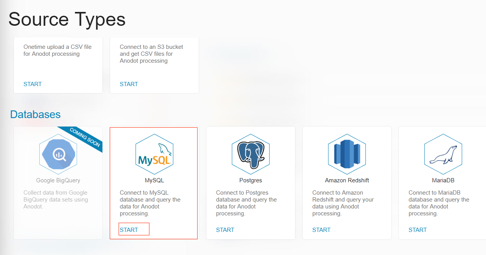

进入mysql 配置，输入数据库连接相关的配置，根据需要去取消或者打上Use SSL, 之后点击LIST DATABASES刷新下，就可以在Database一栏去选择我们的数据库了，最后点击Continue

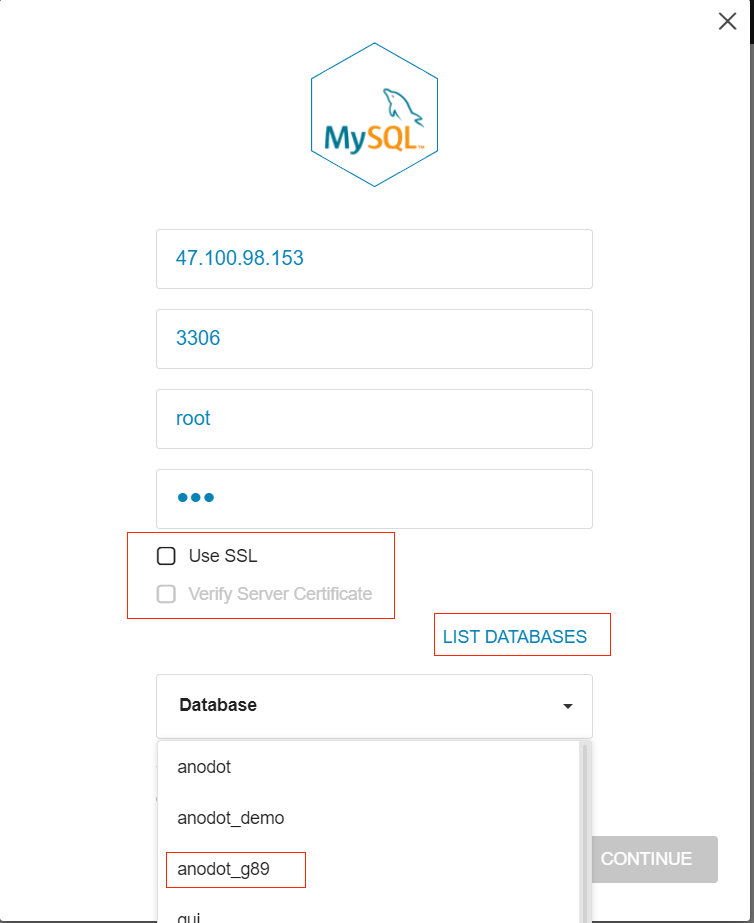

## 创建数据流

数据流是Anodot定义的获取数据的一个定时器Stream Query，它会根据我们的配置，从相遇的表中定时把数据传到Anodot。

在source那里，先选中我们的数据源，这样我们可以看到Streams+会高亮变蓝，我们点击+号：

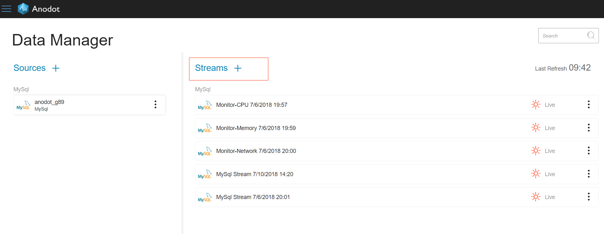

在Table Data里面选择我们所需要创建的流，如cpu：

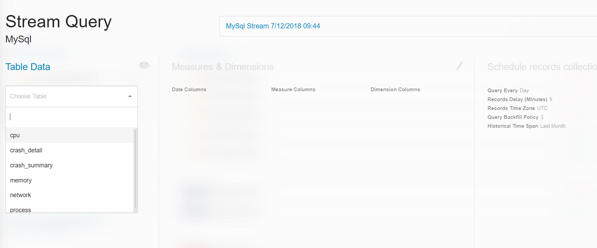

我们可以看到，时间列为time,
测量值列只能是数据类型（浮点或整形）：id, idle, iowait, system, user, 其中id只是数据表的id，对我们来说并不是我们关心的值，所以我们要删除它。
维度列：group_id, host， 一般是字符串类型，是具有固定范围值的列，并不是测量指标。

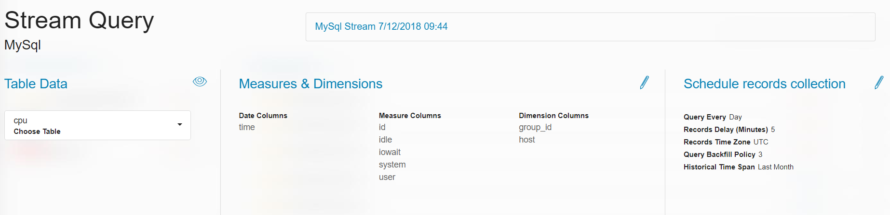

我们点击Measures&Dimensions最右边的笔的图标，可以进行修改我们的选择，比如删除id，点击id右边的x, 最后点击右上角的x号就会自动保存。

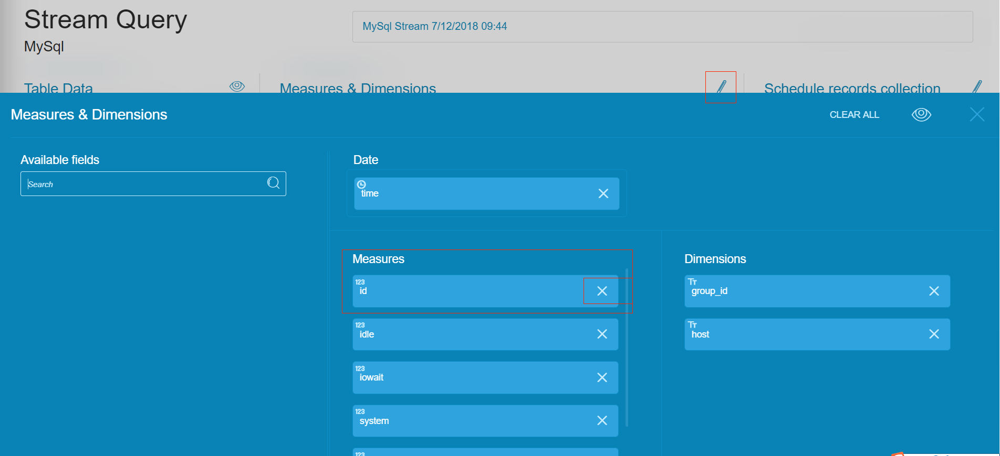

同理我们也可以修改Schedule records collection

- Query every: 查询数据库的时间间隔
- Records Time Zone: 时区
- Historical Time Span: 初始化流的历史数据数量
- Records Delay: 拉取数据的延时时间，我们可以设置为0
- Query Backfill Policy: 数据回填测量，1000表示回填当前时间往前推(1000*数据间隔)的数据。

比如说我们可能因为故障有1个星期的数据没有传上去，我们的query间隔是5，也就是只会把当前时间往前推1000*5/60/24=3.47天的数据回填到anodot，3.47天之前的数据就不会传上去。

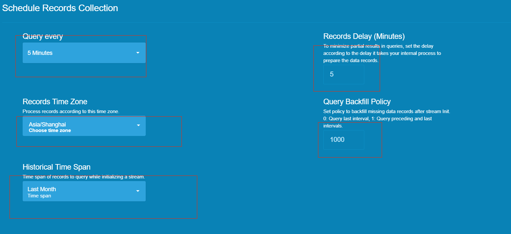

点击x保存。我们可以选择中间区域修改我们流的名字，方便识别，最后一只点击next进行流的初始化操作，此时可能根据初始化数据的大小需要一定的时间。

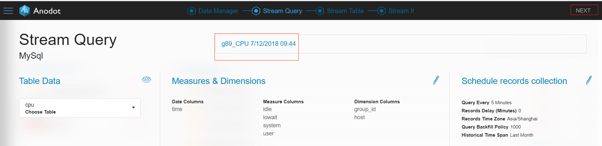
