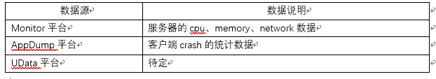
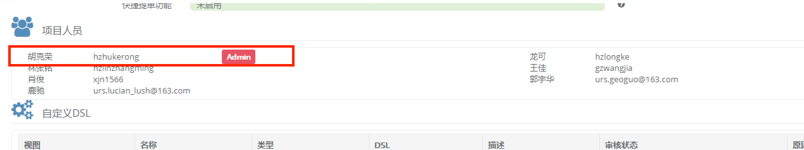
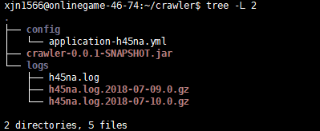
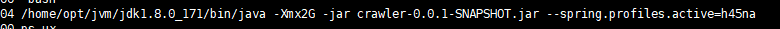
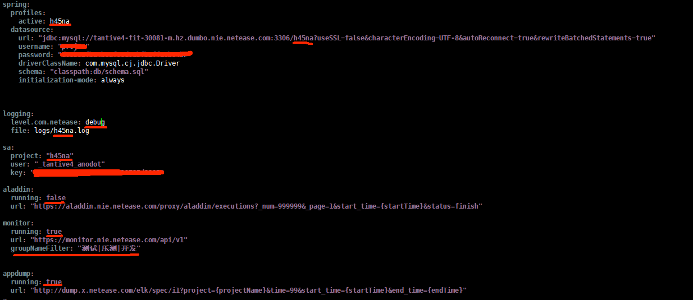

<html>
    <a href="http://anodot.nie.netease.com/" class="homepage-corner" aria-label="View source on Github">
        <svg width="100" height="100" viewBox="0 0 250 250" style="fill:#40c9c6; color:#fff; position: fixed; top: 0; border: 0; right: 0;" aria-hidden="true">
            <path d="M0,0 L250,250 L250,0 Z"></path>
            <text x="40" y="40" fill="white" style="font-size: 36px;" size="20" transform="rotate(45 70,70)">Anodot Project</text>
        </svg>
    </a>
    </style>
</html>


# 2.1 系统接入说明

## 数据源说明



## 接入步骤

在接入前找到对接人，完成如下步骤即可：
- **确定数据源范围（项目组确定）**

每个项目可以根据实际需求确定需要接入Anodot系统的数据源。

- **各数据源权限申请（工具组主导，项目组配合）**

各平台数据权限申请方式见后文

- **数据收集服务部署**

平台这边会给每个项目部署单独的数据采集服务

- **Anodot系统配置**

平台这边会给每个项目在Anodot系统上配置项目专属账号

## 平台权限申请方式

- **Monitor平台**

将`_tantive4_anodot` 系统账号添加到项目的Workflow中，给QA权限即可。一般找项目SA即可添加。

- **AppDump平台**

找项目组AppDump网页上的管理员添加 `_tantive4_anodot`账号，AppDump管理员可以在AppDump上看到：


- **UData平台**

待定

## 数据收集服务器部署

目前数据收集是所有项目用一套代码，使用配置文件来设定数据库、数据源等配置。代码地址：

```
ssh://git@git-qa.gz.netease.com:32200/anodot/BI-Crawler.git
```

- 部署机器是：***10.246.46.74***，路径：***/home/xjn1566/crawler***。目录结构如下：




config目录是各项目的配置文件，命名形式是***application-{project_code}.yml***

logs目录是各服务的log目录

crawler-0.0.1-SNAPSHOT.jar是jar包


- 运行方式

使用supervisor监控运行，配置放在 ***/home/xjn1566/supervisor_conf*** 软连接到 ***/etc/supervisor/conf.d*** 目录中，启动命令为：




> 内存一般2G就行，注意添加spring.profiles.active配置

- Application 文件修改

如下图，有下划线的部分需要根据项目具体情况做修改



## Anodot系统配置
待定
