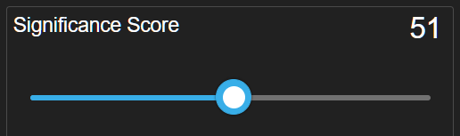

<html>
    <a href="http://anodot.nie.netease.com/" class="homepage-corner" aria-label="View source on Github">
        <svg width="100" height="100" viewBox="0 0 250 250" style="fill:#40c9c6; color:#fff; position: fixed; top: 0; border: 0; right: 0;" aria-hidden="true">
            <path d="M0,0 L250,250 L250,0 Z"></path>
            <text x="40" y="40" fill="white" style="font-size: 36px;" size="20" transform="rotate(45 70,70)">Anodot Project</text>
        </svg>
    </a>
    </style>
</html>

# 5.1 创建Alert

## 视频教学

闲话不说，先看Anodot官方视频叫你如何创建一个Alert

<iframe width="700" height="390" src="https://www.youtube.com/embed/hd0roaHyqMM" frameborder="0" allow="autoplay; encrypted-media" allowfullscreen></iframe>

下面我们在通过文字详细描述下过程

## 创建新的Alert

- 1.在主导航面板上，单击“Alerts”。显示All Alerts窗口。
- 2.单击New，显示新的警报窗口。

> 注意:要编辑现有警报，请从所有警报中选择警报，并从警报管理面板中编辑警报。
在新的警报窗口中，选择警报设置或侧向箭头以显示设置面板。

## 定义Metrics

可以参照之前Metrics的相关文章

## 设置警报类型:

#### Anomaly:当有偏离正常行为值的Metrics数值时进行识别

设置Metrics数据时间尺度间隔[1分钟/5分钟/1小时/1天/1周]。

设置最小时间间隔。
  - 选择一个时间段[分钟/小时/天/周]
  - 移动滑动条，选择时间段

当想要在异常触发时发出警报，可以设置Direction。默认值是Up & Down。

#### Anomaly高级设置

单击 以显示附加的设置。
设置警报的Significance Score。Significance Score是Anodot对异常的重要性的评估。重要程度取决于Metrics与Metrics过去异常情况相比偏离预期模式的程度和时间。

设置度量值的最小增量。最小增量可以设置为绝对值，也可以设置为百分比，或者两者都设置。
注意，如果选择Auto calculate，那么在警报中，Anodot将默认的最小值的90%设置为默认值的90%。对于单个Metric，最小增量是其平均值的10%。最小增量以周期性的方式重新计算和更新。

若要在至少一段时间内没有数据时发送警报，请单击YES，并选择周期的值，并键入周期。

注意:默认情况下，如果没有数据，警报不会被发送
发送警报,选择
- 当检测到异常和异常关闭时，打开OPEN & CLOSE通知[默认值]
- OPEN 标识只有在发现异常时才发出通知

`Enable auto tuning by Anodot`是默认的选项

当检测到更改时，Anodot将响应，并相应地自动调整警报。

#### Static:当有大于或小于静态阈值的Metrics数值时进行识别

Metric值设置:
- 如果Metric值大于或等于您的值，则选择提醒
- 如果Metric值小于或等于您设置的值，则选择提醒

#### No Data Alert:当一段时间内没有连续的Metrics数据时进行识别

要定期收到警报更新，请选择`YES`发送更新通知，并在几分钟内设置`Minimum interval between updates in minutes`

#### 其他操作
1)	设置一个唯一的标题，描述，严重性和状态。
2)	设置通道和用户
3)	更改拥有权[只供行政及警告拥有人使用]
