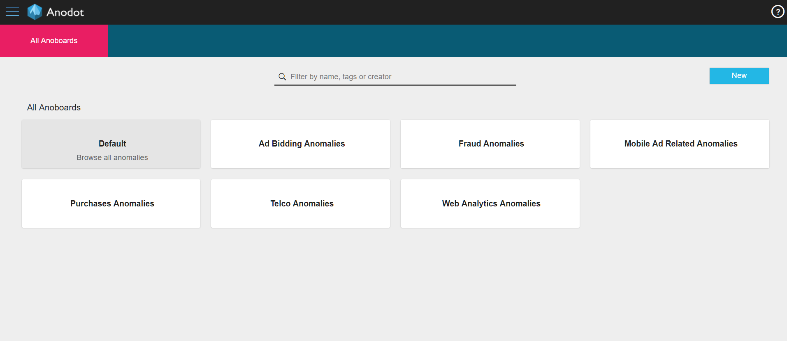

<html>
    <a href="https://www.anodot.com/" class="homepage-corner" aria-label="View source on Github">
        <svg width="100" height="100" viewBox="0 0 250 250" style="fill:#40c9c6; color:#fff; position: fixed; top: 0; border: 0; right: 0;" aria-hidden="true">
            <path d="M0,0 L250,250 L250,0 Z"></path>
            <text x="40" y="40" fill="white" style="font-size: 36px;" size="20" transform="rotate(45 70,70)">Anodot Project</text>
        </svg>
    </a>
    </style>
</html>

# 6.1 Anoboard

每个异常都显示为一个定制的Anodot Dashboard，在预定义的一组度量中显示异常。要查看Anodot Dashboard，请从Anodot任务栏中选择Anomalies选项卡。

anoboard使团队和个人能够在一组Metric中创建定制的异常视图，这些指标代表了他们负责跟踪的度量标准。选择一个Anodot Dashboard，可以检查从警报通知中收到的问题。
当前值超过了度量的学习法线值时，Anodot可以确定发生了异常。Anodot还根据异常的大小和持续时间为每个异常分配了一个重要性分数。
同时经历异常的相关度量被分组在一起。单个异常的重要性评分分别确定，一组异常的显著性评分为组合加权值。
所有用作过滤值都会分别被每个度量值单独维护，以便您可以在调查异常时更改它们。
> 注意:相关指标由Anodot的行为拓扑学习算法发现。

Anoboard异常以两种格式显示:

- **Anomap**-异常是一个条形图，它包含了当前被这个Anoboard过滤的所有指标，它们最相关的属性和值使用颜色编码和特定时间范围的大小进行相关度排序。

- **Anomiles Line Charts** - 在指定的时间范围内同时显示一个或一组指标。异常的每个实例都显示在一个单独的图表中。
