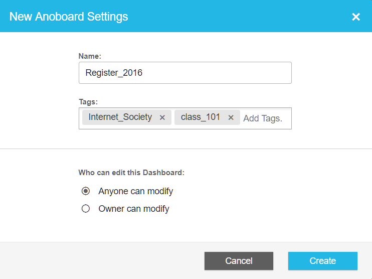
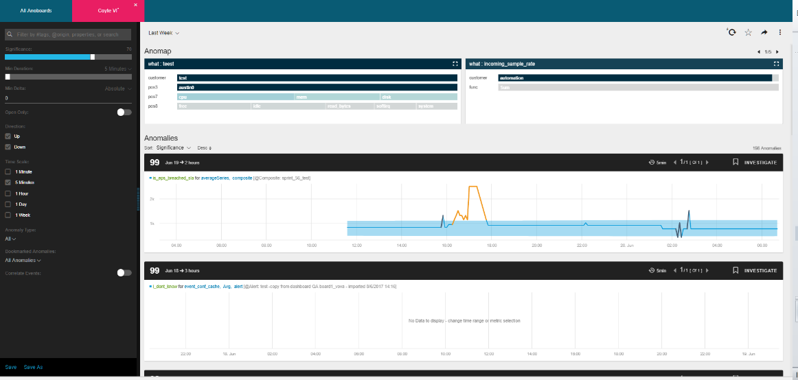
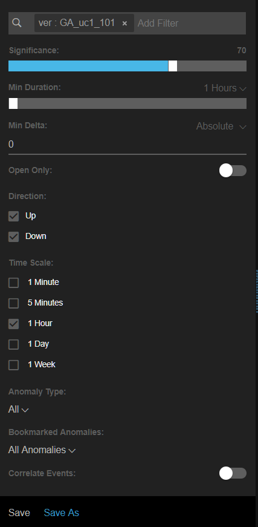

<html>
    <a href="https://www.anodot.com/" class="homepage-corner" aria-label="View source on Github">
        <svg width="100" height="100" viewBox="0 0 250 250" style="fill:#40c9c6; color:#fff; position: fixed; top: 0; border: 0; right: 0;" aria-hidden="true">
            <path d="M0,0 L250,250 L250,0 Z"></path>
            <text x="40" y="40" fill="white" style="font-size: 36px;" size="20" transform="rotate(45 70,70)">Anodot Project</text>
        </svg>
    </a>
    </style>
</html>

# 6.2 创建一个Anoboard块

为了创建一个新的Anoboard tile：
- 在导航栏我们首先点击Anomiles > New
- 会弹出New Anoboard Settings对话框

  - 新输入一个Anoboard名称
  - [可选]添加标签。开始输入一个标签，如果标签存在，它会显示在下拉菜单中。或者通过在标记字段中输入完整的名称来创建一个新的标记。在选择Create之后，将自动保存新的标记。
  > 注意:可以向块中添加无限数量的标记。使用标签用来组织、过滤和搜索您的Dashboard屏幕。

  - 选择谁可以编辑这个Dashboard。

- 单击Create。新的Anoboard会在一个单独的tab中打开。

- 在Filter by tokens，properties 或者 search panel 可以进行选择或设置:

- Significance 水平可以通过滑动条进行调整
- 最小持续时间，从时间下拉菜单中选择时间[分钟/小时/天]，然后通过滑动最小持续时间条设置时间
- 最小增量，从Delta下拉菜单中选择百分比或绝对值，然后通过滑动Delta条选择百分比或使用上下滚动条选择绝对增量值来设置。
- 单击Open Only控件，只显示未解决的异常。
- 当显示异常值高于或低于所选阈值时的方向:
  - 高于或低于(默认)
  - 只有当异常值高于设置的阈值时才显示
  - 只有当异常值低于设置阈值时才显示。
- Time Scale时间间距有[1min/5min/1hour/1day/1week]
- Anomaly type 异常类型 [All/Transient/Pattern Change]
  - All
  - 正常范围模式中的一种瞬变峰值
  - 范围模式的正常行为的改变
- 标记异常显示
  - Mine-我标注过的异常
  - Other’s-被其他人标注的异常
  - None-没有书签的异常
  - All Bookmarked-被标注过的异常
  - All Anomalies-忽略过滤条件的所有异常
- 激活相关事件切换以显示与异常相关的预定义事件。(可选)
- 从下拉菜单中选择异常/异常工作区上的时间范围。
- 选择异常排序[开始日期/意义/绝对Delta >上升/下降]顺序。
- 单击Save。Anoboard将会保存到Anoboards Dashboard窗口
