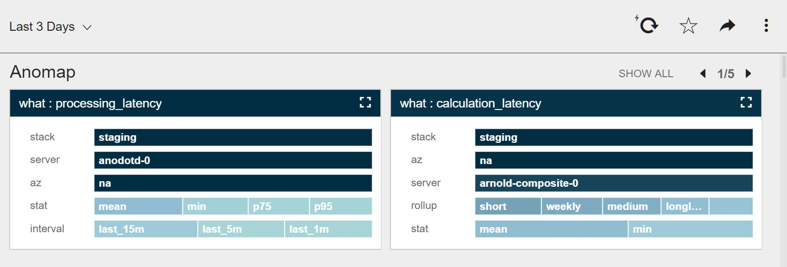
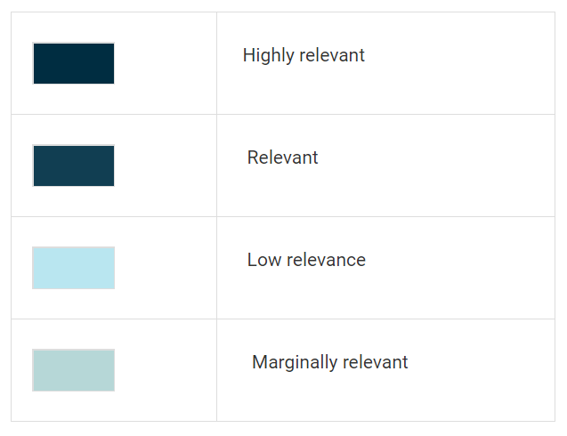
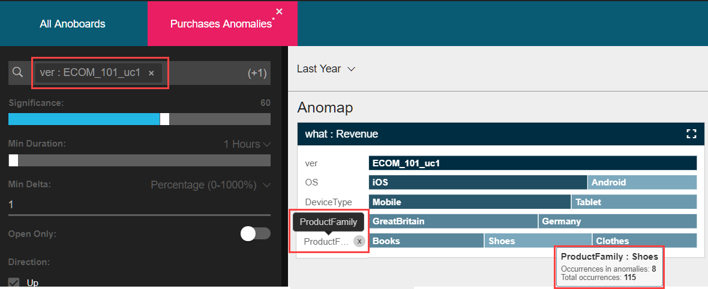

<html>
    <a href="http://anodot.nie.netease.com/" class="homepage-corner" aria-label="View source on Github">
        <svg width="100" height="100" viewBox="0 0 250 250" style="fill:#40c9c6; color:#fff; position: fixed; top: 0; border: 0; right: 0;" aria-hidden="true">
            <path d="M0,0 L250,250 L250,0 Z"></path>
            <text x="40" y="40" fill="white" style="font-size: 36px;" size="20" transform="rotate(45 70,70)">Anodot Project</text>
        </svg>
    </a>
    </style>
</html>

# 6.3 Anomap

异常研究的重点是分离异常的Metric的属性和值。命名规则按关联性排序。默认情况下，5个最相关的维度属性都显示在每个异常的Anomap上。可以更改在Anomap上显示的属性维度
- 单击Save。Anoboard将会保存到Anoboards Dashboard窗口

相关评估用不同的颜色代码和尺寸比例进行表示

> 注意：要进一步细化Anomap，请单击任意一个属性值。它将被添加到过滤器中，并自动应用于所有显示的图表和异常。

