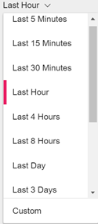
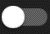
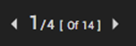
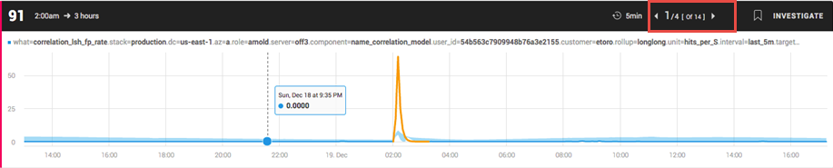
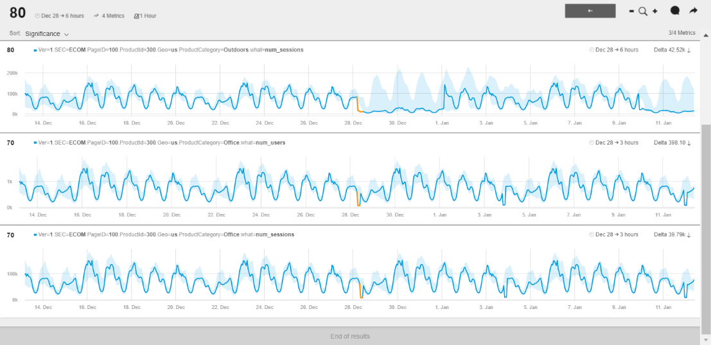

<html>
    <a href="https://www.anodot.com/" class="homepage-corner" aria-label="View source on Github">
        <svg width="100" height="100" viewBox="0 0 250 250" style="fill:#40c9c6; color:#fff; position: fixed; top: 0; border: 0; right: 0;" aria-hidden="true">
            <path d="M0,0 L250,250 L250,0 Z"></path>
            <text x="40" y="40" fill="white" style="font-size: 36px;" size="20" transform="rotate(45 70,70)">Anodot Project</text>
        </svg>
    </a>
    </style>
</html>

# 6.4 Anomile报表

为了查看一个异常报表
- 需要在Navigation中点击Anomalies，所有的Anoboards页面将会显示出来
- 点击一个你想要查看的Anomalies卡片块
- 向下滚动到异常。默认情况下，显示最后一小时的所有异常。
- 要更改时间范围，在时间范围下拉列表中，选择一个时间范围，要么是最后n个范围值中的一个，要么是自定义的，可以打开日期和时间选择器对话框进行编辑。

- 为了观察更多或更少的异常现象，将Significance条左右移动，以降低或者提高异常的重要性打分。
- 查看更短或更长持续时间的异常，将最小持续时间条左右滑动。
- 点击Open Only  控制只显示打开的异常
-   表示在Anomalies 筛选器面板选择的参数总数中显示出了哪些度量指标超出了异常中的度量指标的总数。  
- 例如在下面这个例子中:
  - 1)	1 =满足异常参数的4个指标中的1个
  - 2)	4 =所选异常参数的Metric总数
  - 3)	14 =异常的Metric的总数
 

 - 标记一个异常，可以点击书签图标  ，操作和之前的书签操作类似。
 - 为了显示分组异常，可以点击Metrics信息栏中的INVESTIGATE按钮，在分组中的所有异常将会显示出来，返回Anoboard窗口，可以点击返回箭头

 
